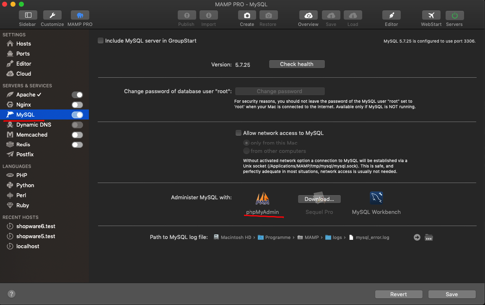

# Local installation on mac \(MAMP\)

For quick and easy installation you can also use **MAMP** on mac.

## Preparation

* Download & install MAMP from [https://www.mamp.info/de/downloads/](https://www.mamp.info/en/downloads/)

First of all you have to modify the PHP settings inside MAMP as seen on the following screenshot:


After that start the mysql & webserver-service with the toggle buttons on the left side in the MAMP management console.

## Prepare MySQL user & database

Open the **MySQL Tab** on the left side and click on the _PhpMyAdmin_ icon - if the icon is grayed out, check if the mysql and webserver services are running.



Inside PhpMyAdmin switch to the user account management on the top menu and click _add new user_.

Choose a username \(e.g. shopware\) and a password and set the option _Create database with same name and grant all privileges_. Also, set the option _Check all_ in the **Global privileges** card. Afterwards, all checkboxes in this card should be checked.

Finish this step by clicking _GO_.

## Make sure MAMP php binary is used globally on your CLI

_Open the terminal application_

```bash
which php
# /Applications/MAMP/bin/php/php7.2.14/bin/php &lt; should be displayed
# IF NOT
vim ~/.bash_profile
export PATH=/Applications/MAMP/bin/php/php7.2.14/bin:$PATH
# :wq to save the file
source ~/.bash_profile
```

## Make sure MAMP mysql binary is used globally on your CLI

_Open the terminal application_

```bash
which mysql
# /Applications/MAMP/Library/bin/mysql &lt; should be displayed
# IF NOT
vim ~/.bash_profile
export PATH=/Applications/MAMP/Library/bin:$PATH
# :wq to save the file
source ~/.bash_profile
```

## Install `brew`

_Open the terminal application_

```bash
/usr/bin/ruby -e "$(curl -fsSL https://raw.githubusercontent.com/Homebrew/install/master/install)"
```

## Install npm / node

_Open the terminal application_

```bash
brew install node
```

## Install composer

_Open the terminal application_

```bash
php -r "copy('https://getcomposer.org/installer', 'composer-setup.php');"

php -r "if (hash_file('sha384', 'composer-setup.php') === '48e3236262b34d30969dca3c37281b3b4bbe3221bda826ac6a9a62d6444cdb0dcd0615698a5cbe587c3f0fe57a54d8f5') { echo 'Installer verified'; } else { echo 'Installer corrupt'; unlink('composer-setup.php'); } echo PHP_EOL;"

php composer-setup.php

php -r "unlink('composer-setup.php');"
```

## Make composer globally

```bash
mv composer.phar /usr/local/bin/composer
```

## Checkout shopware

```bash
# Choose your own directory
cd ~/PhpstormProjects/
mkdir shopware
cd shopware
git clone https://github.com/shopware/development.git
cd development
git clone https://github.com/shopware/platform.git
```

## Shopware 6 setup

### **First of all add new host in MAMP:**​​​​&lt;/p&gt;

* Hostname = shopware
* Port = 8000
* Document Root = Browse for the public directory inside the new directory that you used before \(e.g. /PhpstormProjects/shopware/development/public\)


### **Change the installation settings**

```bash
# Inside the shopware installation directory (e.g.  /PhpstormProjects/shopware/development)
bin/setup
```

You will be prompted to enter several information. In short:

* Application environment: Just hit enter to apply the default `dev`
* URL to your /public folder: `http://shopware:8000`
* Database host: Just hit enter to apply the default `localhost`
* Database port: Just hit enter to apply the default `3306`
* Database name: Enter the name of your database that you created earlier, `shopware` was suggested
* Database user: Enter the name of your MySQL user, that you created previously
* Database password: Enter the password of the new MySQL user

Afterwards a file called `.psh.yaml.override` is created, which contains all those information you just entered.

### **Start Shopware 6 setup**

```bash
# Inside the shopware installation directory (e.g. /PhpstormProjects/shopware/development) 
./psh.phar install
```

After that the setup is done. You can now access your Shopware 6 installation using the following urls:

* Storefront: [http://shopware:8000](http://shopware:8000)
* Admin: [http://shopware:8000/admin](http://shopware:8000/admin) \(User: admin, password: shopware\)

## Trouble shooting

There are cases when the administration is not build correctly and having error messages similar to these:

> ERROR in foobar/vendor/shopware/storefront/Resources/app/administration/src/main.js Module Error \(from ./node\_modules/eslint-loader/index.js\):
>
> ✘ [https://google.com/\#q=import%2Fno-unresolved](https://google.com/#q=import%2Fno-unresolved) Casing of ./modules/sw-theme-manager does not match the underlying filesystem  
> foobar/vendor/shopware/storefront/Resources/app/administration/src/main.js:1:8
>
> ✘ [https://google.com/\#q=import%2Fno-unresolved](https://google.com/#q=import%2Fno-unresolved) Casing of ./extension/sw-sales-channel/page/sw-sales-channel-detail does not match the underlying filesystem  
> foobar/vendor/shopware/storefront/Resources/app/administration/src/main.js:3:8
>
> ✘ [https://google.com/\#q=import%2Fno-unresolved](https://google.com/#q=import%2Fno-unresolved) Casing of ./extension/sw-sales-channel/view/sw-sales-channel-detail-theme does not match the underlying filesystem  
> foobar/vendor/shopware/storefront/Resources/app/administration/src/main.js:4:8
>
> ✘ [https://google.com/\#q=import%2Fno-unresolved](https://google.com/#q=import%2Fno-unresolved) Casing of ./init/api-service.init does not match the underlying filesystem  
> foobar/vendor/shopware/storefront/Resources/app/administration/src/main.js:6:8

The underlying problem is that Mac supports case insensitive paths but not the tools that build the administration. Therefore make sure to execute the commands in an context where the `pwd` is written in the correct case.

Ok: `/Users/shopware/Code/shopware-platform` Not ok: `/users/shopware/code/Shopware-Platform`

